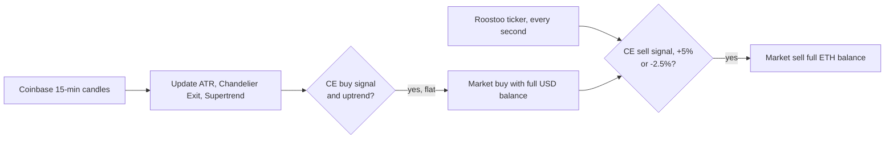

# Web3 Quant Trading Bot — Chandelier Exit + Supertrend

A fully automated, live trend-following bot for **ETH/USD**, built for the **HK University Web3 Quant Trading Competition (Flow Traders × Roostoo Labs, Oct–Nov 2025)** by team *100BTC*. It traded unattended on the Roostoo exchange for the length of the competition: pulling market data, computing indicators bar by bar, and placing signed orders through a REST API.

**Highlights**

- **Live, autonomous execution** on 15-minute bars, with price checks every second for take-profit and stop-loss.
- **Indicators written from scratch** in Python: a Chandelier Exit with ratcheting stops and a Supertrend filter, updated incrementally rather than recomputed over the whole history.
- **Exchange integration without an SDK**: HMAC-SHA256 request signing, market orders, balance queries, and retries with exponential backoff.
- **Instant start**: indicators are warmed up from historical candles at launch, so the bot can trade from its first bar.

Built by team: [POON Ka Hang (Jack): HKUST Computer Science + MATH](https://github.com/KaHangPoonJack) and [SIT Chak Hong (Ivan): HKUST Biotechnology + MATH](https://github.com/ChakHongSit).

## Strategy

The bot trades long-only, in or out of ETH, using two trend indicators on 15-minute candles.

| Component | Settings | Role |
|---|---|---|
| **Chandelier Exit (CE)** | 22-bar lookback, 3.5 × ATR(22) | Primary trend signal. The long stop sits 3.5 ATR below the highest close of the last 22 bars and can only move up; the short stop mirrors it. Direction flips when the close crosses the opposite stop. |
| **Supertrend** | ATR(10), factor 3 | Short-term confirmation, so the bot doesn't buy into a downtrend. |
| **Take-profit / stop-loss** | +5% / −2.5% | Hard exits, checked every second against the live price (2:1 reward to risk). |

**Rules**

| | Condition |
|---|---|
| **Enter long** | CE flips from short to long **and** Supertrend shows an uptrend |
| **Exit** | CE flips to short, **or** profit reaches +5%, **or** loss reaches −2.5% |



## How it works

1. **Warm-up.** On start, the bot downloads recent 15-minute ETH-USD candles from Coinbase's public API and initialises the ATR, Chandelier Exit and Supertrend from them.
2. **Bar loop.** At every 15-minute boundary it fetches the newly closed candle, updates the true range and both indicators, and checks for a CE direction flip.
3. **Price loop.** Every second it reads the last traded price from the Roostoo ticker to track the open position's profit and loss.
4. **Execution.** Orders go to the Roostoo REST API, signed with HMAC-SHA256 over sorted, timestamped parameters. Entries and exits are market orders with up to five retries and exponential backoff; a fill is accepted only when the exchange reports success with no error.

## Tech stack

Python · pandas · NumPy · requests · Roostoo REST API (HMAC-SHA256) · Coinbase Exchange public API

## Run it

```bash
pip install requests pandas numpy
export ROOSTOO_API_KEY="your-key"
export ROOSTOO_SECRET_KEY="your-secret"
python bot.py
```

Credentials are read from environment variables and are never stored in the code.

## What I learned

- **Exits were too slow.** The Chandelier Exit only flips after a large drawdown from the high, so the bot often gave back much of a winning move before selling. The next version of this bot adds a fast Supertrend (ATR 2, factor 0.5) as a profit-protection exit.
- **Long-only spot means sitting out downtrends.** The bot could only be in ETH or in cash, so falling markets produced no profit at all.
- **All-in sizing concentrates risk.** Every entry used the full USD balance; sizing by signal strength or volatility would smooth the equity curve.

These lessons fed into my later work, including the SG vs HK Quant Trading Hackathon (IMC × Roostoo), where I built an ML-filtered system across 25 coins with confidence-based position sizing and hard stops.

## Repository

```
bot.py      # the live trading bot
README.md


```

*Built for a competition on Roostoo's mock exchange. Not financial advice.*
